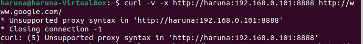

# FINAL PROJECT OS SERVER - 23.83.0962

Membuat Layanan Web Server di **Ubuntu Desktop 22.04.3** dengan spesifikasi berikut:
- **RAM**: 8 GB  
- **Processor**: 4 CPU  
- **Disk**: 50 GB

## Daftar Isi
1. [1. Squid Server](#1-squid-server)
2. [2. Nginx](#2-nginx)
3. [3. Firewalls](#3-firewalls)
4. [4. CI/CD Server (Jenkins)](#4-cicd-server-jenkins)
5. [5. Remote Desktop Server (XRDP)](#5-remote-desktop-server-xrdp)
6. [6. Streaming Media Server (Plex Media Server)](#6-streaming-media-server-plex-media-server)
7. [7. Proxy Server (Squid)](#7-proxy-server-squid)

---

## 1. Squid Server
Penjelasan tentang instalasi dan konfigurasi Squid Server.
### 1.1 Install Squid Server
Langkah 1: Install Squid Server
```
sudo apt install squid
```
### 1.2 Configurasi Squid Server
Langkah 1: Buka repo Squid dengan teks editor (saya menggunakan nano)
```
sudo nano /etc/squid/squid.conf
```
Langkah 2: Allow http port (scroll kebawah sampai menemukan http_port, lalu ganti dengan 8888
```
http_port 8888
```
Langkah 3: buat hostname agar terlihat (scroll kebawah sampai menemukan visible_hostname saya menggunakan hostname haruna)
```
visible_hostname haruna
```
Langkah 4: Masukan ip ubuntu di adapt to list your (ip kamu) IP network from where browsing
```
Masukan ip ubuntu di adapt to list your (192.168.0.101) IP network from where browsing
```
Langkah 5: Restart squid
```
sudo systemctl restart squid.service
```
### 1.3 Cek Squid
Langkah 1: Menguji Squid
```
curl -v -x http://<hostname>:<ip>:<port> https://www.google.com/
```
hostname diisi dengan hostname pada visible, ip adalah ip vm, port adalah port 8888 yang sudah diisi tadi



---

## 2. Nginx
Penjelasan tentang instalasi dan konfigurasi Nginx.
### 1.1 Install Nginx
Langkah 1: update ubuntu dan install nginx
```
sudo apt update
sudo apt install nginx
```
Langkah 2: lihat list firewall
```
sudo ufw app list
```


Langkah 3: allow http nginx
```
sudo ufw allow 'Nginx HTTP'
```
Langkah 4: status nginx
```
sudo ufw status
```


Langkah 5: periksa nginx
```
systemctl status nginx
```


Langkah 6: cek ip ke browser
```
http://server_ip_kamu
```
### 1.2 config nginx
Langkah 1: buat direktori 
```
sudo mkdir -p /var/www/domain_kamu/html
```
Langkah 2: Kepemilkan direktori
```
sudo chown -R $USER:$USER /var/www/domain_kamu/html
```
Langkah 3: buat halaman html
```
nano /var/www/domain_kamu/html/index.html
```
Langkah 4: buat index
```
<html>
<head>
    <title>Warung Nasi</title>
</head>
<body>
    <h1>Selamat Datang di Warung Nasi Haruna Khas Indonesia</h1>

    <h2>Makanan</h2>
    <table border="1" cellpadding="8" cellspacing="0">
        <tr>
            <th>Makanan</th>
            <th>Deskripsi</th>
        </tr>
        <tr>
            <td>Nasi Goreng</td>
            <td>Nasi goreng dengan bumbu dan tambahan telur/ayam.</td>
        </tr>
        <tr>
            <td>Rendang</td>
            <td>Daging sapi dimasak dengan santan dan rempah.</td>
        </tr>
        <tr>
            <td>Sate</td>
            <td>Daging bakar dengan saus kacang.</td>
        </tr>
        <tr>
            <td>Gado-Gado</td>
            <td>Salad sayuran dengan saus kacang.</td>
        </tr>
        <tr>
            <td>Bakso</td>
            <td>Bola daging sapi dalam kuah kaldu.</td>
        </tr>
        <tr>
            <td>Pempek</td>
            <td>Olahan ikan dengan kuah cuko.</td>
        </tr>
        <tr>
            <td>Soto</td>
            <td>Sup daging dan sayuran dengan bumbu rempah.</td>
        </tr>
    </table>

    <h2>Minuman</h2>
    <table border="1" cellpadding="8" cellspacing="0">
        <tr>
            <th>Minuman</th>
            <th>Deskripsi</th>
        </tr>
        <tr>
            <td>Es Teh Manis</td>
            <td>Teh manis dingin.</td>
        </tr>
        <tr>
            <td>Es Cendol/Dawet</td>
            <td>Minuman santan, gula merah, dan cendol.</td>
        </tr>
        <tr>
            <td>Wedang Jahe</td>
            <td>Minuman hangat berbahan jahe.</td>
        </tr>
        <tr>
            <td>Kopi Tubruk</td>
            <td>Kopi bubuk diseduh langsung.</td>
        </tr>
        <tr>
            <td>Bajigur</td>
            <td>Santan, gula aren, dan jahe hangat.</td>
        </tr>
        <tr>
            <td>Es Kelapa Muda</td>
            <td>Air dan daging kelapa muda segar.</td>
        </tr>
        <tr>
            <td>Bandrek</td>
            <td>Minuman jahe dan gula aren.</td>
        </tr>
    </table>
</body>
</html>
```
Langkah 5: Membuat blok server 
```
server {
        listen 80;
        listen [::]:80;

        root /var/www/domain_kamu/html;
        index index.html index.htm index.nginx-debian.html;

        server_name domain_kamu www.domain_kamu;

        location / {
                try_files $uri $uri/ =404;
        }
}
```
Langkah 6: aktifkan
```
sudo ln -s /etc/nginx/sites-available/domain_kamu /etc/nginx/sites-enabled/
```
Langkah 7: Menghindari kemungkinan masalah memori hash bucket
```
sudo nano /etc/nginx/nginx.conf
```


Langkah 8: Uji konfigurasi
```
sudo nginx -t
```
Langkah 9: Restart nginx
```
sudo systemctl restart nginx
```
### 1.3 config website
Langkah 1: Masuk super user
```
sudo su
```
Langkah 2: masuk direktori var
```
cd /var/www/html/
```
Langkah 3: cek direktori
```
ls -l
```


Langkah 4: Hapus index
```
rm index.nginx-debian.html
```
Langkah 5: buat index baru
```
pico index.html
```
Langkah 6: Restart nginx
```
/var/www/html# /etc/init.d/nginx restart
```
Langkah 7: cek apakah sudah aktif apa belum
```
/etc/init.d/nginx status
```
Langkah 8: Jika sudah aktif silahkan masuk ke browser lalu masukan ip
```
http://server_ip_kamu
```
---

## 3. Firewalls
Penjelasan tentang instalasi dan konfigurasi Firewalls.

---

## 4. CI/CD Server (Jenkins)
Penjelasan tentang instalasi dan konfigurasi CI/CD Server menggunakan Jenkins.

---

## 5. Remote Desktop Server (XRDP)
Penjelasan tentang instalasi dan konfigurasi Remote Desktop Server menggunakan XRDP.

---

## 6. Streaming Media Server (Plex Media Server)
Penjelasan tentang instalasi dan konfigurasi Streaming Media Server menggunakan Plex Media Server.

---

## 7. Proxy Server (Squid)
Penjelasan tentang instalasi dan konfigurasi Proxy Server menggunakan Squid.

