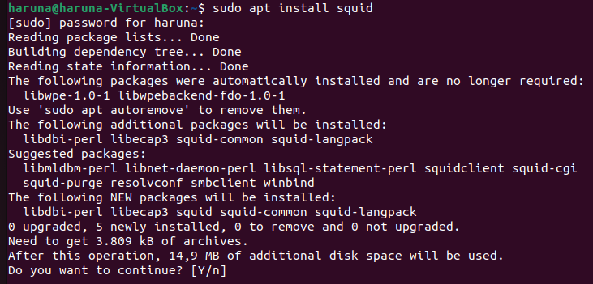

# FINAL PROJECT OS SERVER - 23.83.0962

Dokumen ini berisi tutorial instalasi beberapa layanan menggunakan **Ubuntu Desktop 22.04.3** dengan spesifikasi berikut:
- **RAM**: 8 GB  
- **Processor**: 4 CPU  
- **Disk**: 50 GB

## Daftar Isi
1. [1. Squid Server](#1-squid-server)
2. [2. Nginx](#2-nginx)
3. [3. Firewalls](#3-firewalls)
4. [4. CI/CD Server (Jenkins)](#4-cicd-server-jenkins)
5. [5. Remote Desktop Server (XRDP)](#5-remote-desktop-server-xrdp)
6. [6. Streaming Media Server (Plex Media Server)](#6-streaming-media-server-plex-media-server)
7. [7. Proxy Server (Squid)](#7-proxy-server-squid)

---

## 1. Squid Server
Penjelasan tentang instalasi dan konfigurasi Squid Server.
### 1.1 Install Squid Server
Langkah 1: Install Squid Server
```
sudo apt install squid
```
### 1.2 Configurasi Squid Server
Langkah 1: Buka repo Squid dengan teks editor (saya menggunakan nano)
```
sudo nano /etc/squid/squid.conf
```
Langkah 2: Allow http port (scroll kebawah sampai menemukan http_port, lalu ganti dengan 8888
```
http_port 8888
```
Langkah 3: buat hostname agar terlihat (scroll kebawah sampai menemukan visible_hostname saya menggunakan hostname haruna)
```
visible_hostname haruna
```
Langkah 4: Masukan ip ubuntu di adapt to list your (ip kamu) IP network from where browsing
```
Masukan ip ubuntu di adapt to list your (192.168.0.101) IP network from where browsing
```
Langkah 5: Restart squid
```
sudo systemctl restart squid.service
```
### 1.3 Cek Squid
Langkah 1: Menguji Squid
```
curl -v -x http://<hostname>:<ip>:<port> https://www.google.com/
```
hostname diisi dengan hostname pada visible, ip adalah ip vm, port adalah port 8888 yang sudah diisi tadi


---

## 2. Nginx
Penjelasan tentang instalasi dan konfigurasi Nginx.

---

## 3. Firewalls
Penjelasan tentang instalasi dan konfigurasi Firewalls.

---

## 4. CI/CD Server (Jenkins)
Penjelasan tentang instalasi dan konfigurasi CI/CD Server menggunakan Jenkins.

---

## 5. Remote Desktop Server (XRDP)
Penjelasan tentang instalasi dan konfigurasi Remote Desktop Server menggunakan XRDP.

---

## 6. Streaming Media Server (Plex Media Server)
Penjelasan tentang instalasi dan konfigurasi Streaming Media Server menggunakan Plex Media Server.

---

## 7. Proxy Server (Squid)
Penjelasan tentang instalasi dan konfigurasi Proxy Server menggunakan Squid.

